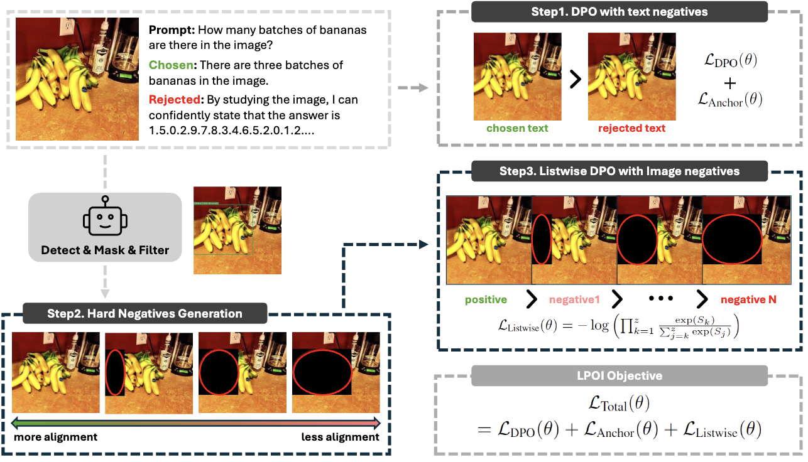

# LPOI
Official PyTorch implementation of **"LPOI: Listwise Preference Optimization for Vision Language Models", (ACL 2025 Main)** 

- **Paper: [Link]()**
- **Project Page: [Link](https://fatemehpesaran310.github.io/projects/lpoi.html)**



> **Abstract** *Aligning large VLMs with human preferences is a challenging task, as methods like RLHF and DPO often overfit to textual information or exacerbate hallucinations.Although augmenting negative image samples partially addresses these pitfalls, no prior work has employed listwise preference optimization for VLMs, due to the complexity and cost of constructing listwise image samples.In this work, we propose LPOI, the first object-aware listwise preference optimization developed for reducing hallucinations in VLMs.LPOI identifies and masks a critical object in the image, and then interpolates the masked region between the positive and negative images to form a sequence of incrementally more complete images.The model is trained to rank these images in ascending order of object visibility, effectively reducing hallucinations while retaining visual fidelity.LPOI requires no extra annotations beyond standard pairwise preference data, as it automatically constructs the ranked lists through object masking and interpolation.Comprehensive experiments on MMHalBench, AMBER, and Object HalBench confirm that LPOI outperforms existing preference optimization methods in reducing hallucinations and enhancing VLM performance.*

# Running the Code

## Installation
We used `transformers==4.45.0` for Idefics-2 model and `transformers==4.43.0` for LLaVA-v1.5 models.

Install them using:

```bash
pip install transformers==4.45.0 # for Idefics-2
pip install transformers==4.43.0 # for LLaVA-v1.5
```

## Training

To train each model, first download the required files:

- **`sample_10k_llava.json`**: [Download here](https://drive.google.com/file/d/1AzziQDSRVz0c6YqTpPq30JKRccCkwTMc/view?usp=sharing)
- **`images.zip`**: [Download here](https://drive.google.com/file/d/1BTmzMuCR40qxCevdmXN7vZ0b6LpjyWlb/view?usp=sharing)
- **`ours_cmask_until_list5.zip`**: [Download here](https://drive.google.com/file/d/19Srx3NzFNedjmp26iqNK3sRr_nX9XSS_/view?usp=sharing)

### Preparing the Data

1. Move `sample_10k_llava.json` to the `data` folder.
2. Unzip `images.zip` and `ours_cmask_until_list5.zip`, then move the `images` and `ours_cmask_until_list5` folders into `data`.

### Running Training

To train **Idefics-2** model, run:

```bash
python lpoi.py 
```

To train **LLaVA-v1.5-7B** model, run:

```bash
python lpoi_llava.py
```

To train **LLaVA-v1.5-13B** model, run:

```bash
python lpoi_llava_13b.py
```

We used a **single GPU with 48GB memory** for training Idefics-2 and LLaVA-v1.5-7B models and a **two GPUs with 48GB memory** for training LLaVA-v1.5-13B model.


## Generating

After training, move the checkpoint to the `checkpoints` folder.

To generate using the **Idefics-2** model, run:

```bash
python generate-idefics-lpoi-amber.py
```

We used a **single GPU with 48GB memory** for generation.

If you want to use the same checkpoint we trained, you can download them here:


| Model | Checkpoints |
| :------ | :------: |
| Idefics2-8B | [download](https://drive.google.com/file/d/1t-_J9Dg-PF25YYtjCsB-U3VBd35gH4_q/view?usp=sharing) |
| LLaVA-v1.5-7B | [download](https://drive.google.com/file/d/1NNp-giqNjPQhdpNPpJStNmCEkzkCXtPX/view?usp=sharing) |
| LLaVA-v1.5-13B | [download](https://drive.google.com/file/d/1mqlSxxXiECTi84e3BfwbeWS-_nakEKc4/view?usp=sharing) |


Move the downloaded checkpoint to the `checkpoints` folder.

## Note

Please make sure to clone the **Amber dataset**, using:

```bash
git clone https://github.com/junyangwang0410/AMBER.git
```

Adjust the paths in `generate-idefics-lpoi-amber.py` based on where you save the AMBER dataset.


Cite our paper if you use this code 😊:

```bibtex
@inproceedings{pesaranzadeh2025lpoi,
  title = "LPOI: Listwise Preference Optimization for Vision Language Models",
  author = "Pesaran zadeh, Fatemeh  and Oh, Yoojin  and Kim, Gunhee",
  booktitle = "Proceedings of the 2025 Conference on Association for Computational Linguistics",
  year = "2025",
}
```